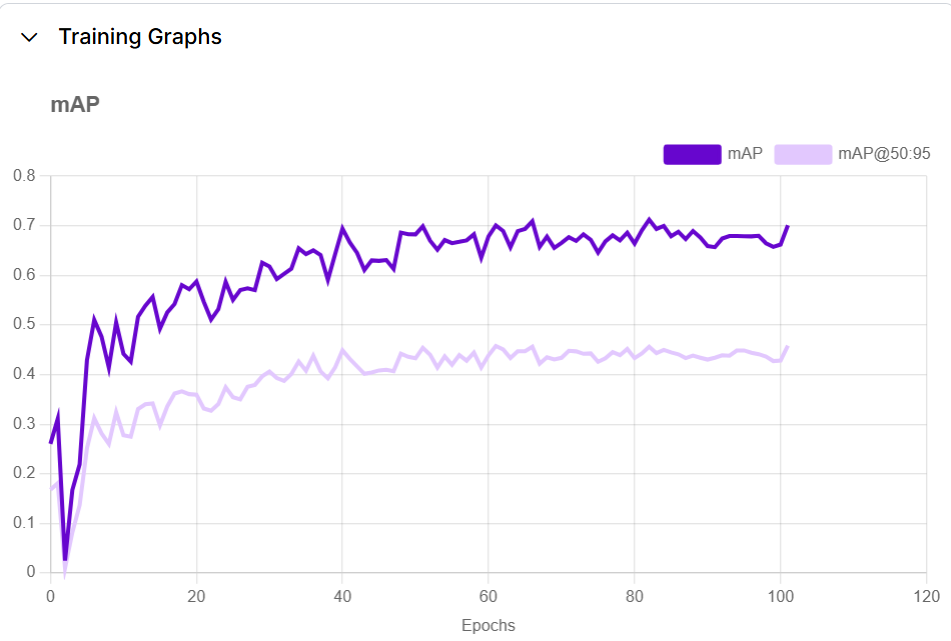
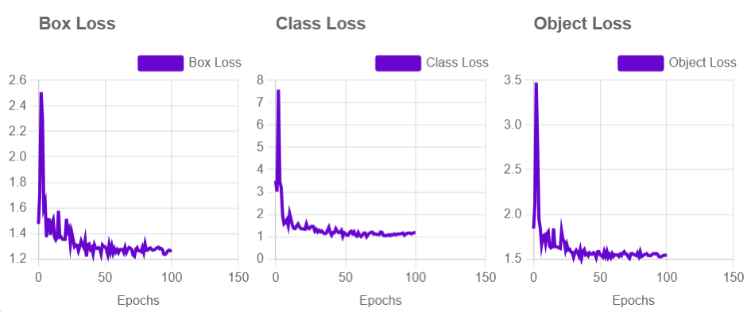
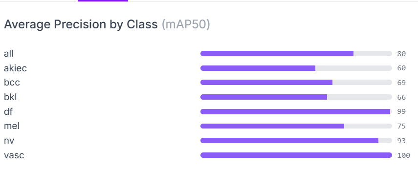

# 🩺 Skin Cancer Detection using YOLOv11  

Proyek ini mengembangkan **sistem deteksi kanker kulit** berbasis **Computer Vision** menggunakan **YOLOv11** dengan bahasa pemrograman Python. Model ini dapat mengenali **7 jenis penyakit kulit** yang dapat diakses melalui aplikasi berbasis web.  

## 📌 Dataset  
Dataset yang digunakan sebanyak 7000 image yang dapat diakses di sini:  
🔗 **[Skin Disease Dataset](https://universe.roboflow.com/uascv-5uxrj/skin_disease-y20fz/dataset/1)**  

Model dilatih untuk mendeteksi **7 jenis penyakit kulit**, yaitu:  
1️⃣ **BCC** (*Basal Cell Carcinoma*)  
2️⃣ **BKL** (*Benign Keratosis-like Lesions*)  
3️⃣ **MEL** (*Melanoma*)  
4️⃣ **Nevus**  
5️⃣ **VASC** (*Vascular Lesions*)  
6️⃣ **Dermatofibroma**  
7️⃣ **Akeic**  

## 📊 Evaluasi Model  
🔹 **Mean Average Precision (mAP)**: 70.1%  
🔹 **Precision**: 69.5%  
🔹 **Recall**: 66.6%  

| **mAP** | **Precision** | **Recall** |
|---------|-------------|------------|
| 70.1%   | 69.5%       | 66.6%      |

## 🚀 Demo Model  
Anda bisa mencoba model ini secara langsung melalui:  
🖥️ **[Streamlit App](https://skindisease-detect.streamlit.app/)** – Jalankan deteksi kanker kulit dengan antarmuka yang mudah digunakan.  
🤖 **[Roboflow Model](https://universe.roboflow.com/uascv-5uxrj/skin_disease-y20fz/model/1)** – Uji model secara online dengan gambar yang Anda unggah.  

## 📸 Hasil Training model 
|  |
|  | 
|  | 

## 🛠️ Teknologi yang Digunakan  
- **Python**  
- **YOLOv11**  
- **OpenCV**  
- **Roboflow**  
- **Streamlit**  

## 🤝 Kontribusi  
Kami terbuka untuk kontribusi! Jika ingin membantu pengembangan, silakan fork repository ini dan ajukan pull request.  
